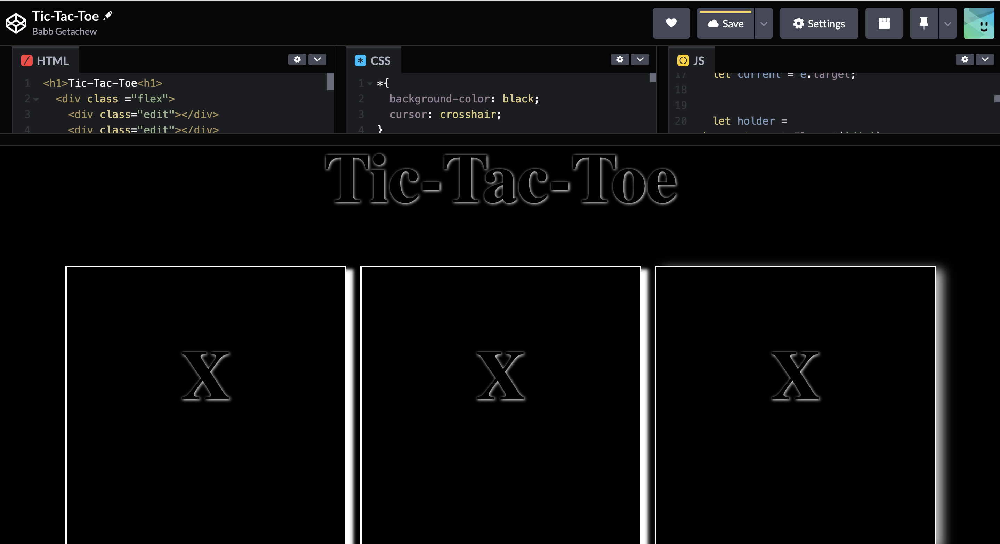

# About this project

During this project, I will be creating a simple Tic-Tac-Toe game that you can play in your web browser. The application is going to ask two users to enter their marker of choice and then start the game. If at any point a user has three markers in a row, they win and the game ends and they will be asked if they want to play again. If at any point there is a tie, the game ends and they will be asked again if they want to go again.

## Topics to be applied

- [x] *Objects*
- [x] *Factory Functions*
- [x] *Module Pattern*
- [x] *Closure*
- [x] *This keyword*
- [x] *Algorithms*
- [x] *DOM manipulation*
- [x] *Prototypal ineritance*
- [x] *Inheritance with Factories*
- [x] *Encapsulation*

### Game Prototype

[Link to CodePen Rough Draft](https://codepen.io/babb2000/pen/oNQwvje)

## Need More Practice
- [ ] *Writing decoupled code*
- [ ] *Modular programming*
- [ ] *Encapsulation and factory functions*
- [ ] *Event listeners in javascript / as well as bubbling, capturing, etc*
- [ ] *CSS selector specificity*
- [ ] *CSS positioning*
- [ ] *Flex-Box shorthands / full capabilities*
- [ ] *Controllers*
- [ ] *Accessing and manipulating the DOM with nested loops*

# Takeaways
- Comfortable with working with the javascript array data type
- Got some practice with factory functions and arrow functions
- Applied knowledge of forEach method when working with 2D arrays 
- Utilized the sort method in creating an algorithm for checking for a winner
- Got introduced to CSS keyframes
- Used javascripts spread and destructoring assignment when extracting data from array